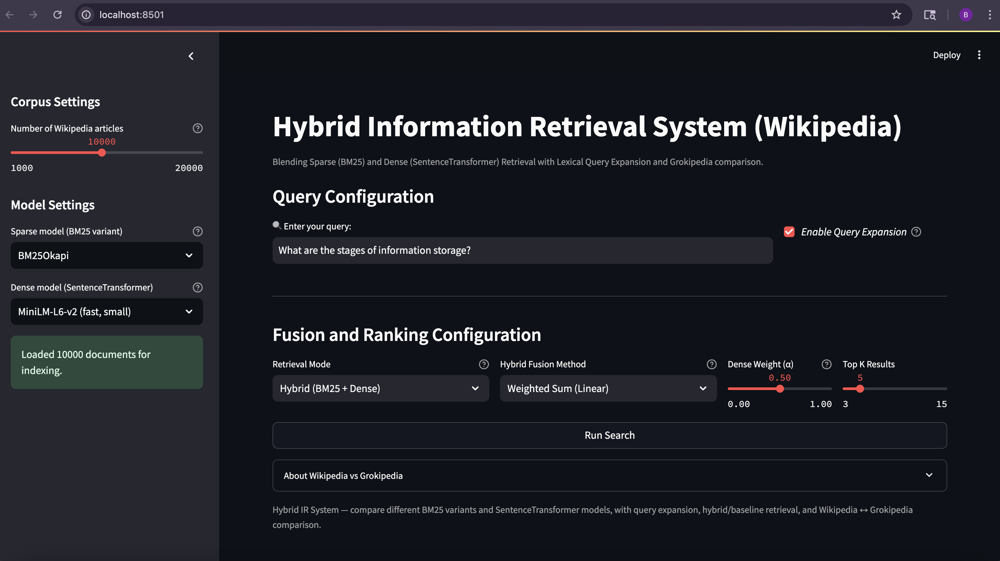

# Hybrid Information Retrieval System (Wikipedia)

Streamlit application for **hybrid information retrieval** over a Wikipedia corpus.

It combines:

- **Sparse retrieval**: multiple BM25 variants (Okapi, BM25L, BM25Plus)
- **Dense retrieval**: SentenceTransformer models (MiniLM, MPNet)
- **Hybrid fusion**: Weighted Sum or Reciprocal Rank Fusion (RRF)
- **Lexical query expansion**: using NLTK + WordNet
- **Baselines**: BM25-only and Dense-only modes
- **Wikipedia ↔ Grokipedia** links: easily compare human-edited vs AI-generated articles

This project was built for *CSC-785-U18* as a course project on Information Retrieval.

## Application UI



## Demo


---

## Features

- **Configurable corpus size**  
  Load between 1,000 and 20,000 English Wikipedia articles from Hugging Face
  (`wikimedia/wikipedia`, snapshot `20231101.en`).

- **Multiple BM25 variants (Sparse models)**  
  - `BM25Okapi`  
  - `BM25L`  
  - `BM25Plus`

- **Multiple dense models (SentenceTransformer)**  
  - `all-MiniLM-L6-v2` – fast, small, good for interactive search  
  - `all-mpnet-base-v2` – slower, but higher-quality embeddings

- **Hybrid & baseline retrieval modes**
  - **Hybrid (BM25 + Dense)** with:
    - Weighted Sum (normalized scores, tunable α)
    - Reciprocal Rank Fusion (RRF)
  - **BM25 baseline** (sparse only)
  - **Dense baseline** (semantic only)

- **Query expansion**  
  Optional lexical expansion using:
  - NLTK tokenization
  - POS tagging
  - Lemmatization
  - WordNet synonyms

- **Result analytics**
  - Shows primary ranking score (hybrid / RRF / baseline)
  - Normalized BM25 and Dense scores per document
  - Top-K result list with article title, snippet, and links

- **Wikipedia & Grokipedia links**
  - Button to open the original **Wikipedia article**
  - Button to open the corresponding **Grokipedia (AI-generated)** page
    (same title, different encyclopedia)

---

## High-Level Architecture

1. **Corpus loader**
   - Loads first *N* articles from Hugging Face Wikipedia dump.
   - Preprocesses text (lower-case, newline removal).
2. **Index & embedding builder**
   - Tokenizes documents and builds selected BM25 index.
   - Encodes documents with selected SentenceTransformer model.
3. **Query processing**
   - Optional query expansion (NLTK + WordNet).
4. **Retrieval**
   - BM25 scores for expanded query tokens.
   - Dense cosine similarity between query embedding and document embeddings.
5. **Fusion & ranking**
   - Hybrid: Weighted Sum or RRF over BM25 & Dense rankings.
   - Baseline modes: BM25-only or Dense-only.
6. **UI**
   - Streamlit interface for:
     - Corpus size
     - Sparse/dense model selection
     - Retrieval mode and fusion method
     - α—weight between sparse and dense
     - Top-K setting
   - Result panel with scores, snippets, and Wikipedia/Grokipedia links.

---

## Requirements

The core requirements (see `requirements.txt`):

```txt
streamlit
datasets
rank-bm25
sentence-transformers
scikit-learn
nltk
torch        # usually installed as a dependency of sentence-transformers

## Setup

```bash
python -m venv .venv
# Windows
.venv\Scripts\Activate.ps1
# macOS / Linux
source .venv/bin/activate

pip install -r requirements.txt
```

## Run

```bash
streamlit run app.py
```

Then open the URL shown in the terminal (usually http://localhost:8501).
